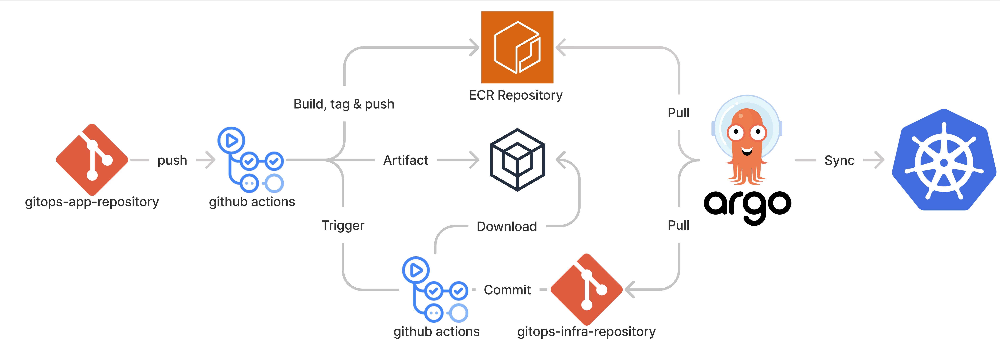

# GitOps Infrastructure Template


## Prerequisite
- Clone [GitOps Application Template](https://github.com/indentcorp/gitops-app-template) and refer to the following `README.md` for customizing project.
- Or, click `Use this template` button on the top right to create a new repository from this template.
- Please be certain that it is a private repository. CD_ACCESS_KEY is only enabled when the repository is private.
- Install [`kubectl`](https://kubernetes.io/docs/tasks/tools/).
- Create ECR Repository for application.
- Set repository Secrets `SOURCE_REPO`.

## How to play
### Create ArgoCD resources
To begin, we will update files in the `./argo` directory to generate project, repository and application for ArgoCD.
Fill in the proper value in the placeholder in the angle brackets. Please review and confirm that the namespace has been created appropriately by contacting the SRE team.

NOTE: We have committed to using the *.yml* extension instead of the *.yaml* extension.

Use `kubectl` to run the following commands in your shell to create a resource in ArgoCD:
```bash
kubectl apply -f argo/
```

### What are the files in the k8s directory?
You don't need to edit those files yourself. Those files are modified in the source repository and sent to this repository for commit.

## Contact
If you have any questions or want to improve GitOps flow, don't hesitate to let us know on [#team-infra-sre](https://indentcorp.slack.com/archives/C02D3SVPWC8) channel! Any contributions you make are greatly appreciated.
